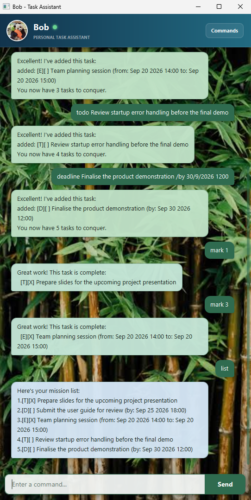

# Bob User Guide

Bob is a friendly personal task assistant for organising to-dos, deadlines, and
events. Enter commands in the message field and press **Enter** or click **Send**.



## Quick start

Use `todo` for a task without a date:

```text
todo prepare slides for the project presentation
```

Use `deadline` when a task must be completed by a particular date:

```text
deadline submit the user guide /by 25/9/2026 1800
```

Use `event` for an activity with a start and end time:

```text
event team planning session /from 20/9/2026 1400 /to 20/9/2026 1500
```

Bob saves your tasks automatically. A missing data file is treated as a new,
empty task list.

## Features

### Add tasks

| Command | Format | Purpose |
| --- | --- | --- |
| `todo` | `todo DESCRIPTION` | Adds a task without a date. |
| `deadline` | `deadline DESCRIPTION /by DATE` | Adds a task with a due date. |
| `event` | `event DESCRIPTION /from DATE /to DATE` | Adds a task for a time range. |

`DATE` must use one of these formats:

- `d/M/yyyy`, for example `2/12/2019`
- `d/M/yyyy HHmm`, for example `2/12/2019 1800`

### View and search tasks

| Command | Format | Purpose |
| --- | --- | --- |
| `list` | `list` | Shows every saved task and its number. |
| `find` | `find KEYWORD` | Finds tasks whose descriptions contain the keyword. |
| `search` | `search PREFIX [PREFIX ...]` | Finds tasks whose descriptions contain every prefix at the beginning of a word. |

Searches are case-insensitive. For example:

```text
search pro meet
```

matches `project meeting`.

### Update tasks

Use the task number shown by `list`:

```text
mark 1
unmark 1
delete 1
```

- `mark NUMBER` marks a task as complete.
- `unmark NUMBER` marks a completed task as incomplete.
- `delete NUMBER` removes a task permanently from the list.

Task numbers start at `1`. Bob will explain the correct format when a command
is incomplete or invalid, and the session can continue after the error.

### End the session

```text
bye
```

Ends the current Bob session.

## Tips

- Click **Commands** in the window header to see the command reference while using Bob.
- Use `list` before `mark`, `unmark`, or `delete` to check the current task numbers.
- Avoid using the `|` character in task descriptions because it is reserved for saved task data.
